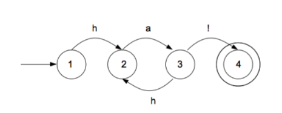
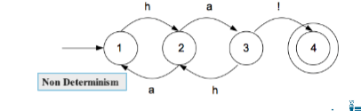

# Morphology

## Translation
Classifying text by language can be done by producing a model of spelling of various languages and matching them to the text.

## Finite state automata
Describe a chain of input with a start and end. Non-deterministic FSAs have chains whose paths cannot be determined (e.g there could be two possible branches)

## Regex
Regexes are equivalent to FSAs and describe the same set of languages (regular languages). Translating regex to FSA can use Thompson Consruction algorithm. [Translating from FSA to regex](http://cs.stackexchange.com/questions/2016/how-to-convert-finite-automata-to-regular-expressions)

## Morphology
Study of how words are built up of smaller units. A morpheme/stem is the smallest unit of meaning (e.g. "say" from "said")

### Affixes
stem + affix
e.g. kick + ed

### Prefixes
prefix + stem
e.g. re + heat

### Circumflexes
e.g. sagen -> gesagt (german for "to say" and "said")

## Inflectional morphology
English has a very simple inflectional system.
Nouns: plurals and possessives
Plurals:
	* Singular vs plural
	* Suffix is "s" when regular
	* Suffix is "es" when ending in one of "s, z, x, ch"
	* Nouns ending in "y" have it changed to "i"

 
