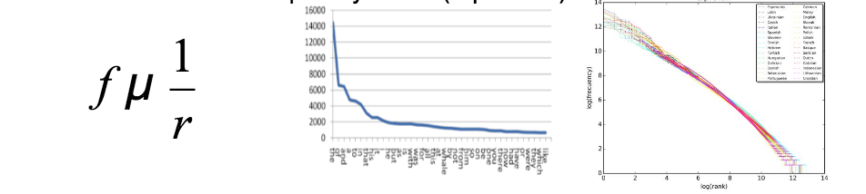
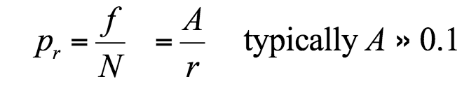

# Proprocessing

## Information retrieval
* Document retrieval given search terms
* Citation tracking and metrics
* Author attribution
* Subject classification

Unlcear relationship between IR and NLP:
* Divergence in 1950s
* Both look at text
* Both employ (often) same techniques
* Sophisticated NLP usually damages IR performance (?). It doesn't work reliably, but this may be changing.

### Classifying errors
* TP: True positive, correct retrieval
* TN: True negative, correctly ignored retrieval
* FP: False negative, incorrect retrieval
* FN: False negative, incorrectly ignored retrieval

Accuracy = (TP + TN) / (TP + TF + FP + FN)
Precision = TPclassified / classified
Recall = TPClassified / TPInCorpus

F1 = 2 * ((precision * recall) / (precision + recall))

## Word normalisation
Every NLP task needs normalisation

* Segmenting / tokenising text
* Normalising words formats
* Segmenting sentences in text
* Deciding over how tokenised text is stored internally and converted

## Terminology
* Corpus: Collection of text
	* Balanced or Specific (with regards to type of text)
* Lemma: stem

## Tokenisation
Somewhat easy in English, hard in other languages.

Some languages join many words such as German, French and Swedish. Some have other alphabets, such as Chinese.

### Tokens vs Types
* Types = vocabulary (distinct words)
* Tokens = number of words
* Stats
	* Shakespeare: 88400 tokens, 31000 types
	* Switchboard: 2400000 tokens, 20000 types
	* Google n-grams: 1000000000 tokens, 13000000 types

## Zipf's Law
The frequency of a word in a corpus is inversely proportional to its rank in the frequency table.

If propobility of word *r* is *p*, and *N* is total number of word occurences.

## Stemming
* Conflates derived words to stem
* Stem is not necessarily morphological root
* "abate", "abated", "abatement", "abatements" and "abates" all stem to "abat", which is not a word
* Imperfect but good for IR

Porter Stemmer:
* Algorithm from 1980
* Trade-off between speed, readability and accuracy
* Stems via transformations applied in succession

### Issues
* Doesn't always produce words, doesn't matter too much for IR as search terms just have to be matched 

...

## Lemmatisation
More sophisticated than stemming and reduces words to their lemma (base form). Similar to Porter but constantly check that word produced is in a dictionary.

"loving" -> "love" (noun) or "loving" (adjective)

IR views lemmatisation as not being worth it. It aids precision but damages recall.

## Case folding
Convert text to same case, there are exceptions with names that must be in a certain case (some companies) et.c

Sentiment analysis needs case to be preserved as information is portrayed through case.

