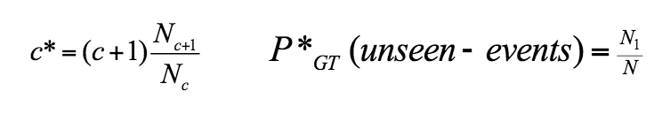
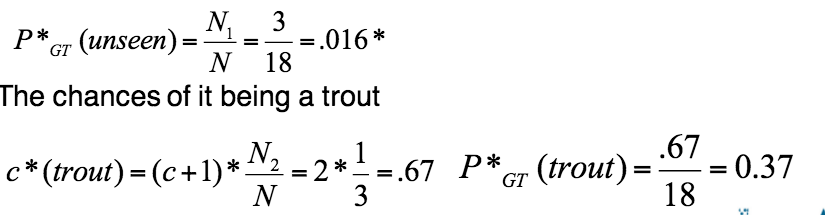
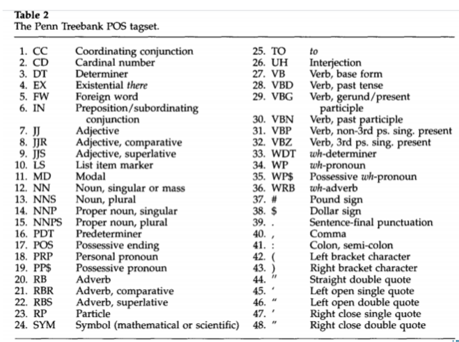
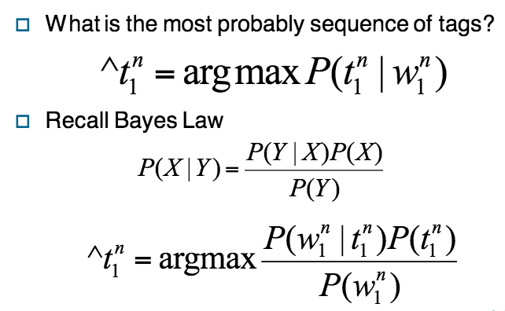
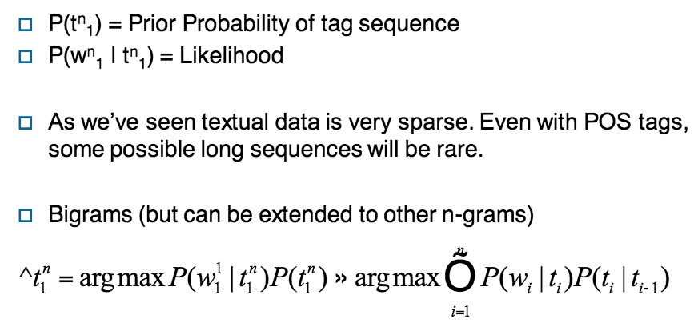
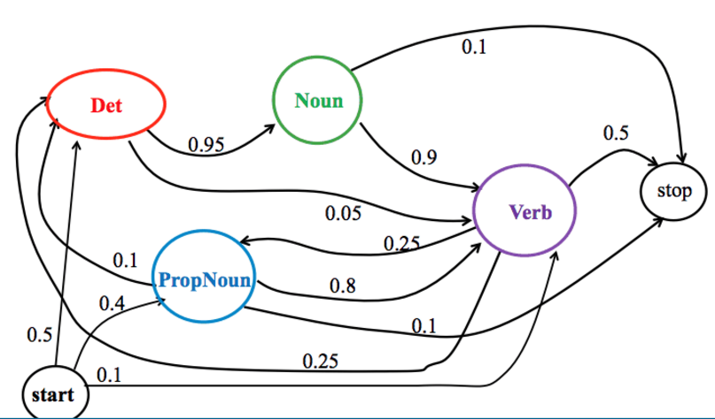

# Good-Turing smoothing
First described by Good (1953) who claims Turing had original idea.

Use count of things you've seen once to estimate things you've never seen.

* Nc: number of n-grams seens c times

Suppose we are fishing in a lake with 8 species and we catch:
* 10 carp
* 3 perch
* 2 whitefish
* 1 trout
* 1 salmon
* 1 eel

A new fish is caught, chance of it being a catfish or bass (unseen):

Issues
* Assumes knowledge of a fixed vocabulary
* Data is sparse, cannot guarantee Nc > 0 for any c

Simple Good-Turing Smoothing (Gale and Sampson 1995)
* Befor calculating counts, replace all zero Nc with a linear regression plotted from non-zero Nc's

# Part of Speech Tags
* Difference categories/classes of words: nouns, verbs, adverbs et.c
* POS = basic building blocks of syntax above morphology
* Originated by Dionysious Thrax of Alexandria who described grammar of Greek

## Tagsets
* Brown Corpus (1979): Million word corpus from 500 samples/genres, 87 tags
* Penn Treebank (1993): Mapping from Brown, 87 tags
* lancaster UCREL CLAWS C5: 100 million words, multi-genre, 61 tags

### Penn Treebank

## POS taggers
Given a sequence of tokens, assign the most likely POS to each token.

Three main approaches
* Hand-crafted
	* Lots of rules and work
	* Earliest approaches (Harris 1962, Klein and Simmons 1963)
	* EngCG (Voutilainen 1999)
		* lexicon plus morhology
		* 56000 lexical entries, 3744 constraints

## Hidden Markov Model tagging
Uses special case of Bayesian inference.

The horse is going to race tomorrow

### Markov assumption

### Markov model
Model of probability branches

### Hidden Markov model
Assumes an underlying set of **hidden** states in which the model can be (e.g. POS). Assumes probabilistic transitions between states over time (e.g. transition from POS to another POS as a sequence is generated).

## Viterbi algorithm (will be a question in exam)
* Based on dynamic programming
* Very similar to minimum string edit distance algorithm
* Input is single HMM plus sequence of words
* Output is most likely sequence of tags
* HMM is defined as two sets of tables
	* Transition probabilities
	* Observation likelihoods for words given tags
* Algorithm given in section 5.5 of Jurafsky and Martin

## Brill tagger (Brill 1995)
Transformation-based learning

* Take POS tagged corpus and copy into
	* Training corpus
	* Gold standard
* Remove tags from training corpus
* Retag training corpus with most likely tag for each word
* Generate protoype rules of the form
	* Change tag a to tag b when preceeding/following word is z
	* Change tag a to b when preceeding/following word is z and the word two before/after is x

### Brill training
* Training
	* From set of prototype rules
	* Choose rule which most transforms training set into gold set
	* Apply rule to whole corpus
	* Repeat until no further improvements made
* Brill tagger is a set of cascading rules which can be applied to new data
