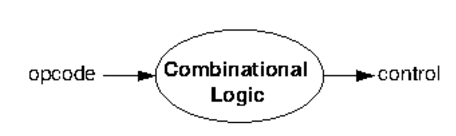
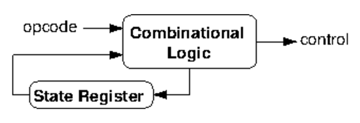

# CPU Control

<Insert stuff from previous lecture>

## Single cycle
The output to the CPU control wires can be computed with a combinatorial control system whose input is the opcode. The function that this combinatorial control system represents can be derived via a truth table and boolean algebra. No state needs to be considered and so it can be simple.

## Multi cycle
When instructions take multiple cycles to complete, a more sophisticated system that takes state into account is used. The datapath state and control wire output depends on both the instruction state **and** the opcode.

## Microcode

...

