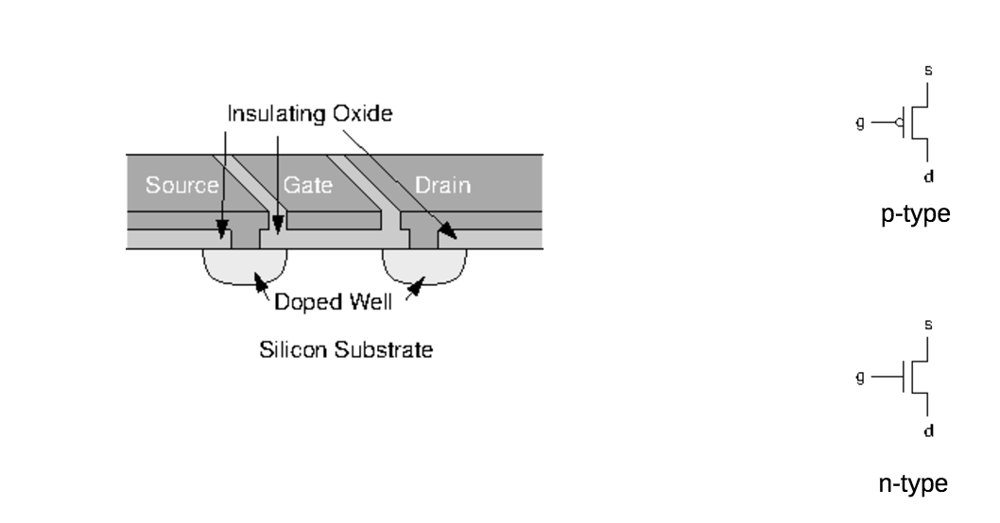
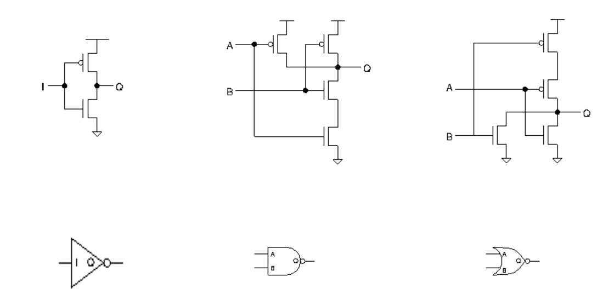
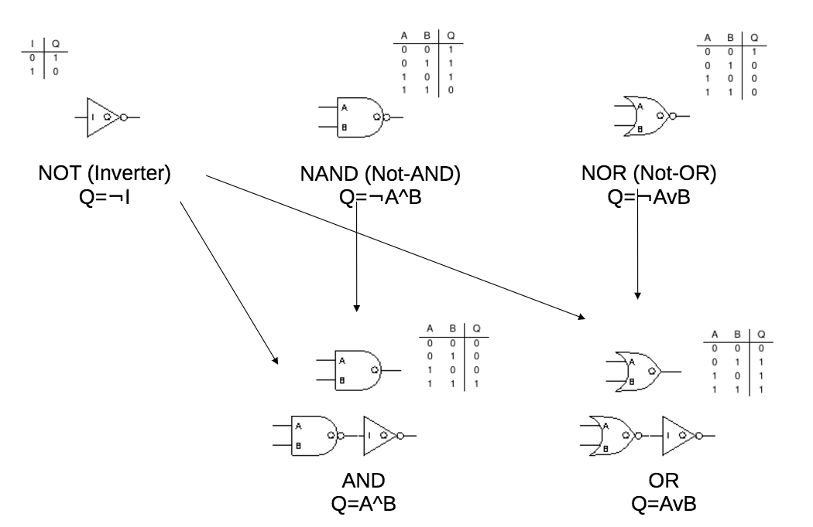

# Logic gates

## CMOS
* Complementary metal-oxide semiconductor
* On/Off switches

### CMOS Transistor

### CMOS Transisitor logic

## Logic gate composition

# Boolean algebra

n = AND (intersection), u = OR (union)

* Identity
	* A u 0 = A
	* A n 1 = A

* Zero and one laws
	* A u ~A = 1
	* A n ~A = 0

* Commutativity
	* A u B = B u A
	* A n B = B n A

* Associativity
	* A u (B u C) = (A u B) u C
	* A n (A n C) = (a n B) n C

* de Morgan's Laws
	* ~(A u B) = ~A n ~B
	* ~(A n B) = ~A u ~B
