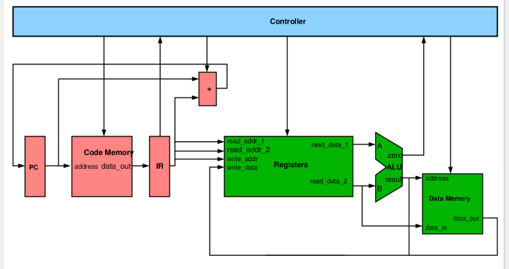
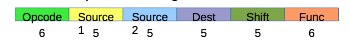
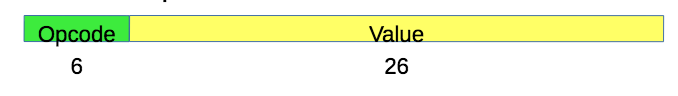

# MIPS

## MIPS architecture


* 32-bit machine
	* Instructions are 32-bit
	* Data stored in 32-bit words
	* Addresses are 32-bit
	* Memory is byte-addressed
* 32 general purpose registers
* Most operations only use registers
* Core ste of around 60 instructions

### MIPS instruction types
* I-type: Requires 1+ registers and a constant

* R-type: Requires 3 registers and a constant

* J-type: Requires a constant


## Register use conventions
| Name | Number | Convention |
| ---- | ------ | ---------- |
| $zero | $0 | Constant 0 value |
| $at | $1 | Reserved for assembler use |
| $v0, $v1 | $2, $3 | Function return and expression evaluation |
| $a0 - $a3 | $4 - $7 | Function arguments |
| $t0 - $t7 | $8 - $15 | Temporaries |
| $s0 - $s7 | $16 - $23 | Temporaries consistent between function calls |
| $t8, $t9 | $24, $25 | Temporaries |
| $k0, $k1 | $26, $27 | Reserved for kernel |
| $gp | $28 | Global pointer (?) |
| $sp | $29 | Stack pointer |
| $fp | $30 | Frame pointer |
| $ra | $31 | Functionr return address (Not put on stack?) |


## Program
```assembly
.data ; Start of static data
.align 2

b: .word 5 ; Allocate and declare a word woth value 5

.text ; Start of code
.globl main ; Makes label visible from the outside

main: ; Entry point

... code ...
```

