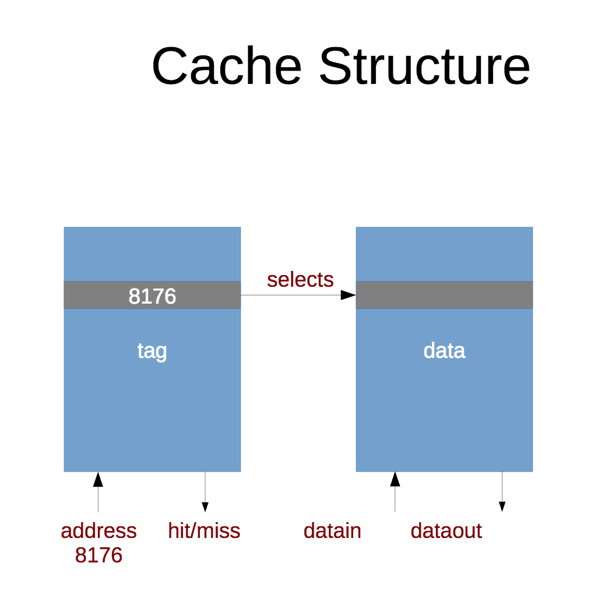
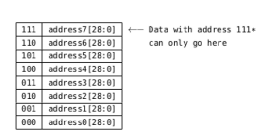
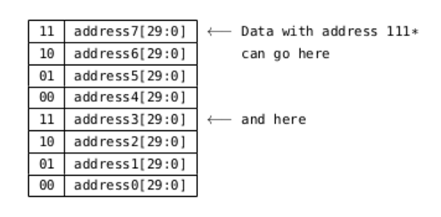
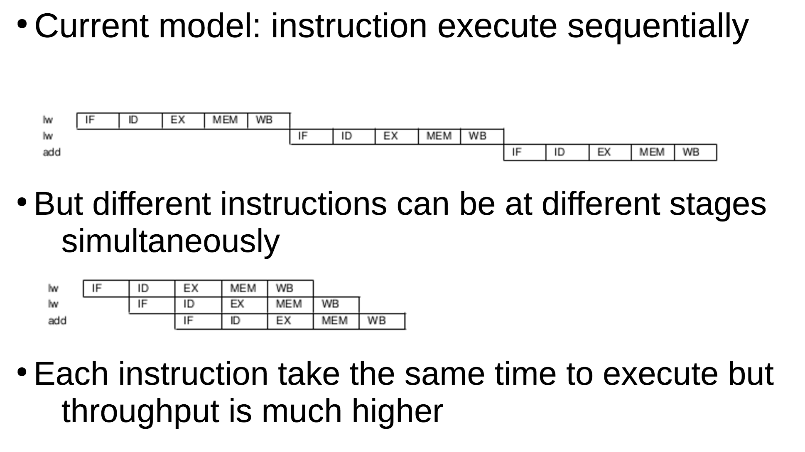

# Improving system performance

## Spatial locality
If byte at address n is used, then the byte at n+1 is likely to be needed next, so it should be cached.

## Temporal locality
If some data in memory is used then it is likely to be needed again, so it should be cached.

## Cache

* Small amount of fast memory located near to or integrated within the CPU
* L1 is closest and fastest, L2 and L3 less so respectively
* Caches for instructions and data are usually separate

Cache stores copies of either:
* Data/instructions that have been used recently
* Data/instructions near (in address) to those being used

The cache maps memory addresses to data and can be queried with an address, with a resulting hit (if address exists in present) or miss (if it is not present).



### Cache associativity
(Below example uses 3-bit memory addresses)
 
* Direct mapped
	* Each address has only one possible cache location
	* There is a risk of **thrashing**

* 2-way: Each address has two possible cache locations


* n-way: One memory address could be found in n cache locations
* Fully associative
	* Each address could be in any cache location (equivalent to n-way where n = address size)
	* The cache tag stores the entire address 

### Calculating cache benefits
* n = number of instructions in program
* m = proportion of those that access memory
* tCyc = CPU cycle time
* tCache = cache access time
* tMem = memory acces time (additive to tCyc)
* h = cache hit rate

* Raw cycle time: n * tCyc
* Cache access time: n * m * tCache
* Memory access time in cache misses: n * m * (1 - h) * tMem
* Total time: tCyc + m * (tCache + (1 - h) * tMem)

## Pipelining
Successive instructions are often independent and therefore there is no need to wait for the previous wone to complete before fecthing the next. Pipelining occurs in stages and each CPU cycle advances the stage by one. One instruction's evaluation starts at stage one, then stage 2, with the next instruction being put in stage 1 and so on.

### MIPS pipelining architecture

Classic RISC stages in MIPS:

1. (IF) Fetch instruction from memory.
2. (ID) Decode instruction and read registers.
3. (EX) Execution.
4. (MEM) Memory access if required.
5. (WB) Write (back) result into register if required.




### Pipelining hazards
Not all sequential instructions are independent.

E.g
```assembly
addi $t0, $t0, 1
add $t0, $t0, $t0
```

`add` instruction is dependent on result of `addi`, as it access registers that are written to by `addi`..

The result of the `addi` is known during the EX stage but won't have been written to the registers, so a delay of 3 cycles has to be inserted before pipelining starts.
